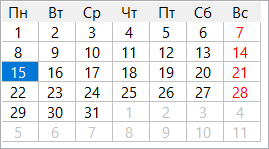
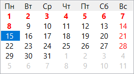

RxLib rxpickdate improved
====================

One day I needed to display a month calendar. The Lazarus standard `TCalendar` component didn't fit my needs, and the component from the RxLib library looked a little different from what I wanted (with its grid lines) and lacked the properties I needed (marking holidays). I modified it to suit my needs and decided to post it here in case anyone else might find it useful.

The `rxpickdate.pas` originally is the file from [RxLib components library for Delphi/Lazarus](https://wiki.freepascal.org/RXfpc), see original copyright inside the source file. I only improved the `TCustomRxCalendar` component and its descendant `TRxCalendarGrid`:

* new property `CalendarOptions` of the `TCalendarOptions` type:

    ```delphi
    type
      TCalendarOption = (cloDrawGrid, cloUseMinDate, cloUseMaxDate, cloDrawFrameToday);
      TCalendarOptions = set of TCalendarOption;
    ```

    Options are:
    * `cloDrawGrid` — draw the grid lines or not,
    * `cloUseMinDate` — use the `MinDate` property (see below) or ignore it,
    * `cloUseMaxDate` — use the `MaxDate` property (see below) or ignore it,
    * `cloDrawFrameToday` — draw the 3D frame around the current date or not.

* two new properties: `MinDate` and `MaxDate`. If `cloUseMinDate` is in the `CalendarOptions` set, and the user tries to select a date (or the programmer tries to assign a date-related property) that is earlier than the `MinDate`, then nothing happens. And the same is true for the `cloUseMaxDate` option and a date later than the `MaxDate`.

* new event handler: `OnGetDateInfo: TOnGetDateInfo`

    ```delphi
    type
      TOnGetDateInfo = procedure (Sender: TObject; ADate: TDate; ADay: Word; ANotInThisMonth: Boolean; var ADayColor: TColor; var ADayBackground: TColor; var AFontStyle: TFontStyles; var ADisabled: Boolean; var AHint: string) of object;
    ```

    This event handler allows you to mark some dates on the calendar with a background and font color / style, to add an individual date hints, and also to make the date disabled (grayed out and unselectable). This is useful if you want to highlight holidays or any other days you need. The `ADate` input parameter and the combination `ADay` + `ANotInThisMonth` can be used interchangeably. Sometimes it is more convenient to check the date, sometimes the day number.

* other imporovements. Specifically, I extended the `TDaysItem` record type and replaced the `DayColor` check with a new `DayIsNotInThisMonth` field when drawing days that are not in the current month, to avoid collisions, such as having that color match the color of a weekend or a disabled date.

Before and after (dates highlighted in red are Orthodox Christmas holidays):

 